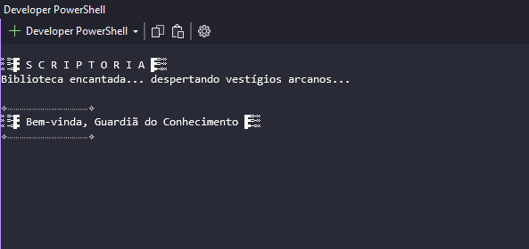
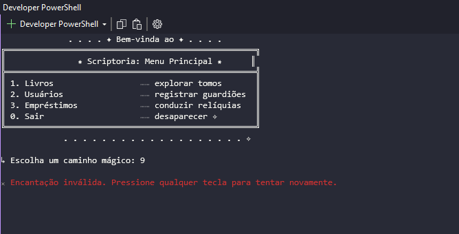
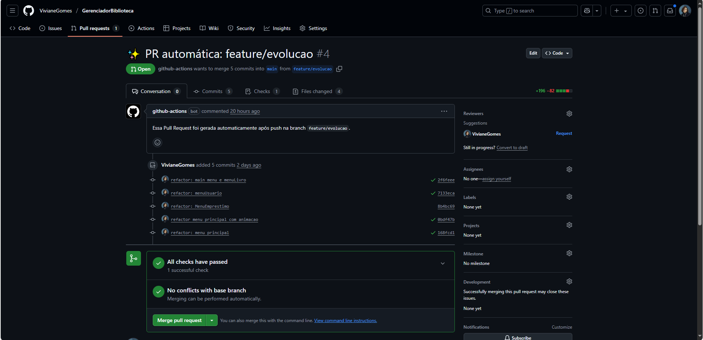

# 📚 Scriptoria – Gerenciador de Biblioteca

Sistema modular para gestão de acervo, usuários e empréstimos de uma biblioteca.  
Desenvolvido com foco em boas práticas de **arquitetura limpa**, separação de responsabilidades e evolução organizada de **Console App → API REST**.

---

## ✨ Funcionalidades

- 📖 Cadastro, listagem e remoção de livros
- 👤 Gerenciamento de usuários
- 🔁 Registro de empréstimos com histórico
- 🔍 Consulta por ID com retorno amigável
- ❌ Validações e mensagens de erro claras
- 🧱 Estrutura modular: Domain, Infra, App, API
- 🧪 Pronto para testes unitários

---

## 🛠️ Tecnologias & Conceitos

- .NET (C#)
- Arquitetura em camadas inspirada na Clean Architecture
- Injeção de dependência
- Console App com navegação interativa por menu
- Planejamento para API com ASP.NET Core + Entity Framework Core

---

## 📂 Estrutura da Solução

```

GerenciadorBiblioteca.sln
├── GerenciadorBiblioteca.Domain/ → Regras de negócio e entidades
├── GerenciadorBiblioteca.Infra/ → Persistência e repositórios
├── GerenciadorBiblioteca.App/ → Lógica de aplicação e orquestração
├── GerenciadorBiblioteca.Api/ → (em planejamento) Interface REST
└── GerenciadorBiblioteca.Tests/ → Testes unitários

```

---

## 🚀 Como executar localmente

💻 Pré-requisitos: .NET SDK 7.0+ instalado e ambiente Windows recomendado

1. **Abra o PowerShell**

   - Pressione `Win + S`, digite “PowerShell” e abra o terminal

2. **Clone este repositório**

   ```powershell
   git clone https://github.com/VivianeGomes/GerenciadorBiblioteca
   ```

3. **Navegue até a pasta do projeto**

   ```powershell
   cd "$env:USERPROFILE\Documents\GerenciadorBiblioteca"
   ```

4. **(Opcional) Verifique os arquivos**

   ```powershell
   ls
   ```

5. **Restaure os pacotes NuGet**

   ```powershell
   dotnet restore
   ```

6. **Acesse a pasta do Console App**

   ```powershell
   cd .\GerenciadorBiblioteca.App\
   ```

7. **Execute o projeto**
   ```powershell
   dotnet run
   ```

🎉 O menu do Scriptoria aparecerá no console. Agora é só navegar!

> **💡 Observação:** este passo a passo considera um ambiente Windows com .NET previamente instalado e caminho padrão de pastas. Caso esteja usando outro sistema, tenha configurado diretórios diferentes ou esteja partindo de um fork, ajustes podem ser necessários.

---

> ### 🧰 Problemas comuns e dicas (Troubleshooting)
>
> Se algo não funcionar como esperado, experimente:
>
> - ⚠️ `.NET` não reconhecido? Verifique se o SDK está no PATH
> - ❌ `dotnet restore` falhando? Teste:
>   ```bash
>   dotnet nuget locals all --clear
>   ```
> - 🧭 Usando Linux/macOS? Adapte os comandos de navegação (`cd`, caminhos, barras)
> - 📁 Forkou ou moveu o projeto? Confirme a estrutura e caminhos corretamente
>
> 🔍 Use `dotnet --info` para inspecionar o ambiente local

---

## 📸 Exemplo de Uso

Veja abaixo alguns momentos da aplicação em ação:

- 🎬 **Animação de entrada**
  Uma introdução simples para dar boas-vindas ao Scriptoria
  

- 🧙‍♂️ **Menu Principal**
  Onde a navegação começa — sim, o “Encatação” foi proposital 😄
  

---

## ⚙️ Esteira CI/CD – Meu Xodó 💫

Mesmo sendo um Console App, o Scriptoria conta com uma pipeline automatizada para manter o fluxo de desenvolvimento suave e sem atritos.

📸 **Fluxo atual da pipeline:**


> A esteira executa:
>
> - Criação de Pull Request direto para a branch `main`
> - Validação do build e dependências
> - (Planejado) Gatilhos para testes e deploy quando necessário

Mantém simples e funcional ❤️

---

## 📌 Status do Projeto

| Versão         | Status               |
| -------------- | -------------------- |
| 🖥️ Console App | ✅ Finalizado        |
| 🌐 Web API     | 🛠️ Em planejamento   |
| 🧪 Testes      | 🧱 Estrutura inicial |

---

## 💡 Por que começar com Console App?

> “Começar simples não é retrocesso — é construir com inteligência sobre uma base sólida.”

Essa escolha permitiu foco nas regras de domínio e organização da arquitetura. A evolução para uma API robusta será natural e consistente.

---

## 💬 Contribuições e Feedback

Este projeto faz parte da minha jornada prática como **dev .NET Jr.**
Fique à vontade para abrir issues, sugerir melhorias ou trocar ideias — será um prazer 💜

---

## 📄 Licença

Distribuído sob os termos da [Licença MIT](LICENSE).
